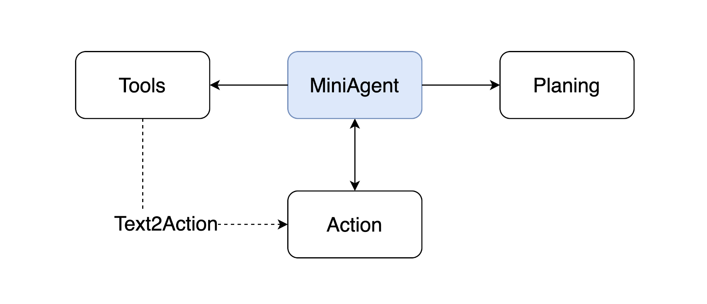

# MiniAgent


Welcome to **MiniAgent**! This framework simplifies the creation of agent-based systems using language models. Inspired by projects like AutoGen and AutoGPT, and frameworks such as Langchain, **MiniAgent** offers a more user-friendly approach. By leveraging plain Python, it makes the learning and debugging process more accessible for both users and developers.

## Overview

**MiniAgent** focuses on planning and tool usage functionalities. It equips language models (LLMs) with various external tools and employs a React prompting strategy for task planning. Since LLMs primarily rely on text, **MiniAgent** performs a "text to action" transformation to convert tool names and arguments into actionable steps.



## Demo

**ArxivBot**
    
This agent can search the related paper from arxiv and send them to the specified email.


**CVBot**
        
This agent can parse a CV with PDF format, and summary it's content.


## Getting Started
This guide will help you set up your development environment to run the **MiniAgent** project.

### Preparing Your Environment

To get started, you'll need to create a new virtual environment and install the required dependencies. Follow the steps below:

```sh
# 1. Create a virtual environment
conda create -n miniagent python=3.10

# 2. Activate the virtual environment
conda activate miniagent

# 3. Install project dependencies
pip install -r requirements.txt
```
For MacOS users, we suggest following the installation instructions provided [here](https://docs.anaconda.com/miniconda/) to install miniconda.


## Quick Start

An agent to analyze a CV.
```python
from miniagent.tools import *
from miniagent.agent import Agent
from miniagent.llm.gpt import ChatGPT, LLMInput
from miniagent.prompt import ReactPromptTemplate

# define a llm
api_key = "xxx"
llm = ChatGPT(api_key=api_keymodel_name="gpt-3.5-turbo")

# define tools
tools = ToolList([PDFReaderTool(max_length=8000)])

# define_agent
agent = Agent(
    llm=llm,
    tools=tools, 
    prompt_template=ReactPromptTemplate())

user_input = "Please help me analyze the CV in the path './examples/cv.pdf', summarize the ability and experience of this candidate, propose 10 questions according to its content."

# start!
output = agent.execute(input=user_input)
```
<details>
<summary>Clik to check the output of this example.</summary>
The CV of Claud D. Park highlights extensive experience in software engineering, cloud infrastructure, and security research. Here’s a summary of their abilities and experience:

### Summary of Abilities and Experience

1. **Education**: 
   - Bachelor’s in Computer Science and Engineering from POSTECH (2010-2017).

2. **Technical Skills**:
   - **DevOps**: Proficient in AWS, Docker, Kubernetes, Terraform, and CI/CD tools like Jenkins and CircleCI.
   - **Back-end Development**: Experience with frameworks such as Koa, Express, Django, and REST API design.
   - **Front-end Development**: Knowledge of React, Redux, HTML5, and CSS preprocessors like SASS.
   - **Programming Languages**: Skilled in Node.js, Python, Java, and OCaml.

3. **Professional Experience**:
   - **Current Role**: Founding member and Site Reliability Engineer at DanggeunPay Inc. since March 2021, responsible for designing cloud infrastructure and improving operational efficiency.
   - **Previous Roles**: Held positions at various companies including DanggeunMarket Inc., Omnious Co., Ltd., and PLATCorp. Responsibilities ranged from infrastructure management, CI/CD pipeline setup, to software architecture.
   - **Research Experience**: Conducted research in machine learning and computer vision during undergraduate studies.

4. **Certifications**: 
   - Multiple AWS certifications including Solutions Architect, Developer, and Security Specialty, as well as Kubernetes and HashiCorp certifications.

5. **Awards and Honors**: 
   - Recognized in international hacking competitions such as DEFCON and AWS competitions, demonstrating strong skills in security and cloud technologies.

6. **Extracurricular Activities**: 
   - Active in the hacking community, with experience in organizing competitions and mentoring aspiring hackers.

### Proposed Questions

1. Can you explain your experience in designing cloud infrastructure and the specific challenges you faced?
2. What strategies did you implement to achieve over 30% cost savings on AWS resources?
3. Describe a time when you introduced a new technology or process that significantly improved operational efficiency.
4. How do you approach security in cloud environments, particularly in financial services?
5. Can you provide details on how you managed the Kubernetes clusters and the specific tools you used for orchestration?
6. Discuss your experience with Terraform and how it has helped in managing infrastructure as code.
7. What role did you play in the on-boarding process for new engineers in your previous positions?
8. How do you ensure continuous improvement in your infrastructure management practices?
9. Describe a project where you implemented a CI/CD pipeline and the impact it had on the development process.
10. What motivates you to stay updated with new technologies and participate in community events like hacking competitions?

This analysis and the questions can help in understanding the candidate's fit for roles involving cloud engineering, software development, and security.
</details>

You can find more details from [here](./examples).

## Details

### Agent

We support three types of agents:

1. **React Agent**: Utilizes a combination of tools to fulfill user instructions.
2. **Response Agent**: Operates based on the output of a specific tool, ideal for tasks like answering questions from URLs or PDFs.
3. **Human Agent**: Facilitates human intervention in a multi-agent system when necessary.

Further details can be found in [docs/agent.md](docs/agent.md).


###  LLM
Now, we only support api-based LLM. You can also use ollama to wrap a local LLM as openai style. Please check [docs/llm.md](docs/llm.md) to use the defined LLM.


### Prompt
When you want to define a prompt as a template for an agent. It should follow the format:
```python
from miniagent.prompt import PromptTemplate

prompt = PromptTemplate(prompt="your_prompt {your_variable_1}, {your_variable_2}", input_variables=['your_variable_1', 'your_variable_2'])
```

The react prompt is defined in [miniagent/prompt/react.py](./miniagent/prompt/react.py).

### Tools

The following tools are supported:

1. **Gmail**: Send emails directly.
2. **Arxiv**: Search for academic papers on Arxiv.
3. **Search Engine**: Retrieve related information from the internet.
4. **PDF Reader**: Convert PDF files into text format for easy access.
5. **Scrap**: Extract information from specified URLs.

For more detailed information about these tools, please refer to [docs/tools.md](docs/tools.md).


## Acknowledgement
This project ed was supported by [Likelyhood Lab](http://www.maxlikelihood.cn/). If you have any questions, please feel free to post an issue or land an email to rayyang0116@gmail.com.